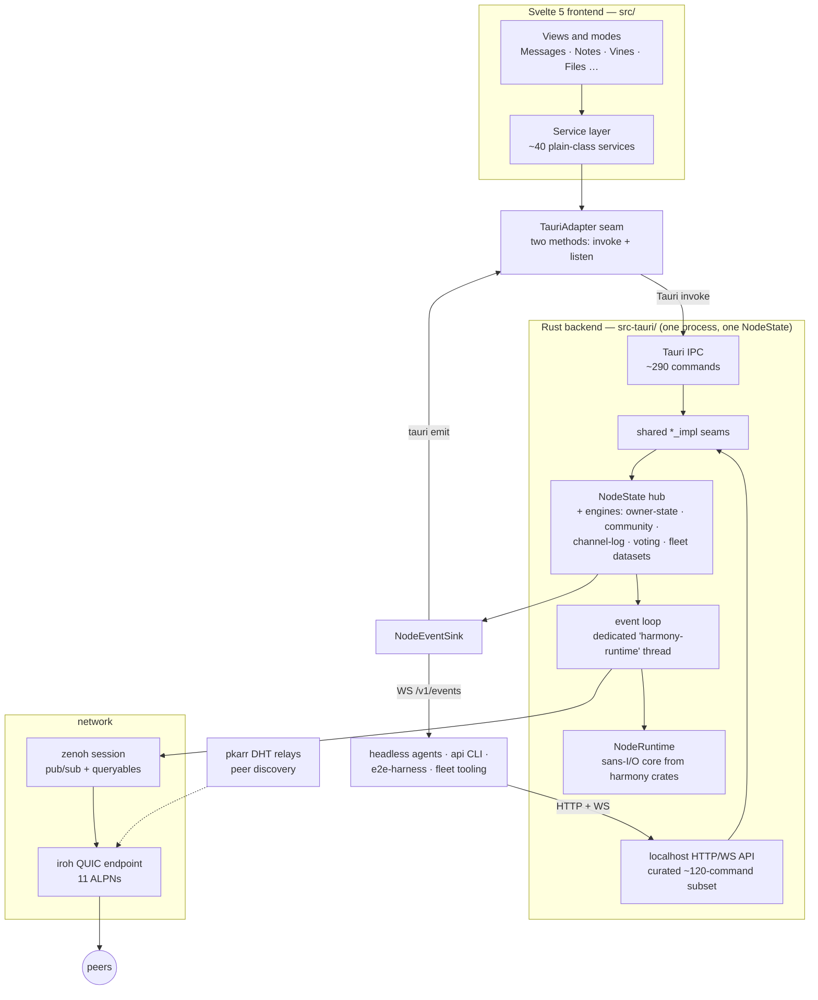
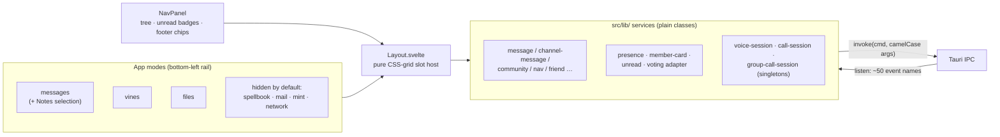
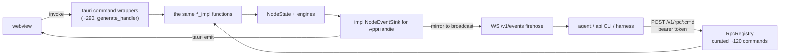
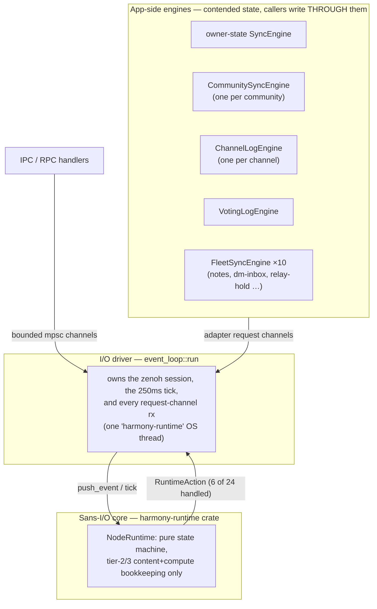
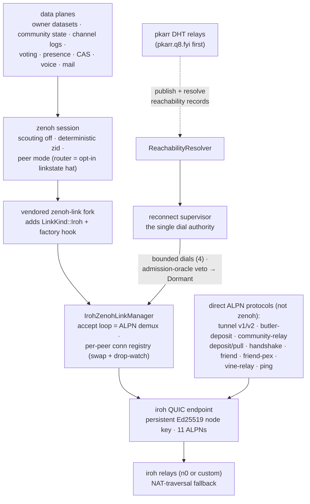
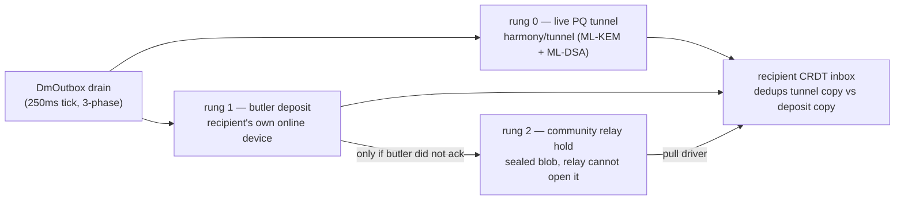
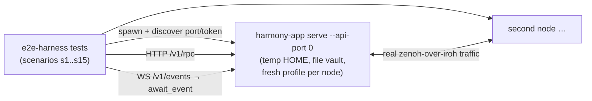

# Harmony client architecture

A map of how the pieces fit together, for engineers arriving at this repo cold.
Read the [at-a-glance diagram](#the-client-at-a-glance) first; each numbered
section after it zooms into one layer. Per-feature design history lives in
[`docs/specs/`](../specs/) (200+ dated design docs — this document is the
entry point they hang off). Developer workflow (tests, CI, conventions) is
[`CLAUDE.md`](../../CLAUDE.md).

Everything below names real symbols and files, so you can jump from any box
to the code with a grep. Counts (commands, events) drift as features land;
treat them as orders of magnitude, and trust the *shape*.

---

## The client at a glance

One process, one node. A Svelte webview talks through a two-method adapter to
a Rust backend; the same backend is equally drivable headless over a localhost
API. All peer traffic — messages, membership, presence, voice, files — flows
over a single zenoh pub/sub session that rides iroh QUIC end-to-end.
There are no application servers: the only third parties are rendezvous
infrastructure (iroh relays for NAT traversal, pkarr relays for discovery),
which see ciphertext and routing metadata only.



Key invariants to carry through the rest of the doc:

- **One node, two front doors.** `harmony-app` (GUI) and `harmony-app serve`
  (headless) run the *same* node; they differ only in which state-access and
  event-sink implementations the API server is handed (§2).
- **Single-writer everywhere.** Contended state is owned by exactly one
  engine/task and mutated through it; the shared `NodeState` mutex is a
  hand-off point, not a place work happens (§3).
- **Every durable plane is a log or CRDT with its own replication discipline**
  — there is no general database (§4).
- **The transport is client-owned.** Zenoh-over-iroh exists because the client
  vendors a `zenoh-link` fork; the harmony-core runtime is embedded only as a
  sans-I/O brain (§5).

---

## 1. Frontend — Svelte 5 + a plain-TypeScript service layer

**Where:** `src/`. Entry `src/main.ts` mounts `App.svelte`; a second
entry `src/network-main.ts` mounts the dev-only network-viz window.

`App.svelte` is deliberately the hub: it constructs the one real adapter,
boots the node, instantiates and cross-wires ~40 services, and hosts every
modal. Components below it are largely presentational.



The load-bearing ideas:

- **The entire frontend↔backend contract is two methods.**
  `TauriAdapter { invoke(cmd, args); listen(event, handler) }` (declared in
  `src/lib/zenoh-service.ts`). Every service takes this interface; the sole
  real construction site is `App.svelte`'s boot IIFE. Rust declares params
  `snake_case`, JS sends `camelCase`; Tauri converts (see `CLAUDE.md`).
- **Services are framework-free classes; reactivity is bolted on at the App
  boundary** — either a snapshot copy (`navNodes = [...navService.nodes]`)
  or a `$state` version counter (`cardVersion++`) that `$derived` reads
  depend on. This keeps services unit-testable against a mock adapter.
- **Browser mode is designed in.** With no Tauri present (`isTauri()` false —
  e.g. plain `npm run dev`), services keep their pre-seeded mock data
  (`src/lib/mock-data.ts` and friends) and the app renders fully. On connect,
  services delete exactly the mock keys *before* registering listeners.
- **Modes:** `AppMode` in `src/lib/types.ts` lists seven; feature flags
  (`src/lib/feature-flags.ts`) hide spellbook/mail/mint/network by default,
  so the shipped alpha surface is Messages (+ Notes), Vines, Files.
- **There is no frontend WebSocket adapter.** Headless parity is achieved
  Rust-side at the event sink (§2), not by teaching the UI a second backend.

Sharp edge: `App.svelte`'s boot ordering is load-bearing in several places
(unread services before their feeders connect; own-address fetch before DM
rehydration). The file documents each with the bug it prevents — read the
comments before reordering.

## 2. One node, two front doors — the IPC boundary and the headless API

**Where:** `src-tauri/src/api/` (`mod.rs`, `rpc.rs`, `gui_host.rs`,
`events.rs`, `auth.rs`, `lock.rs`, `cli.rs`, `watch.rs`) and
`src-tauri/src/node_event_sink.rs`.



- **The HTTP surface is a curated subset, not a mirror.** Each RPC
  registration in `rpc.rs` is a deliberate line added per ticket; a few verbs
  exist *only* headless. The two surfaces also intentionally diverge in
  strictness (`deny_unknown_fields` on HTTP only — independently-versioned
  clients must fail loudly on skew) and error shape.
- **Mode-agnosticism is one trait.** `NodeStateAccess` has two impls:
  `serve` owns the `Arc<Mutex<NodeState>>`; the GUI borrows Tauri's managed
  state (`GuiStateAccess`). The GUI opts into hosting the same API by setting
  `HARMONY_API_PORT` (`gui_host.rs`).
- **Event parity lives at exactly one place.** `impl NodeEventSink for
  AppHandle` mirrors every emission onto the WS broadcast *at the sink*, so
  no emission site — current or future — can miss the agent-visible stream.
  The webview and the WS firehose see one vocabulary (~50 event names).
- **Discovery and mutual exclusion:** the server writes `api/token` (0600)
  and `api/port` under the profile's data dir; `api/serve.lock` (fd-lock) is
  the one-node-per-profile boundary that a GUI-with-API and a `serve` contend
  for.
- **`harmony-app api`** is a thin HTTP/WS client over those discovery files;
  **`harmony-app watch`** turns the event firehose plus backfill into
  resumable NDJSON per channel (HLC cursor).

## 3. Core runtime — boot, the event loop, and the single-writer discipline

**Where:** `src-tauri/src/lib.rs` (`start_node_inner`, `stop_inner`),
`src-tauri/src/event_loop.rs`, plus one engine module per state plane.

There is no type named "kernel". The split people mean by "engine/kernel" is
three layers:



- **`NodeState`** (`lib.rs`) is a ~190-field struct behind one `std::Mutex` —
  the hand-off hub. Handlers lock, clone the `Arc`s they need, drop the
  guard, then await. The documented cross-lock order for the DM path is
  `dm_outbox → crdt_state → hlc_tracker`.
- **The event loop owns the network.** `event_loop::run` takes `NodeRuntime`
  *by value* on a dedicated 8 MiB OS thread (single-worker multi-thread
  tokio — zenoh's `.wait()` panics on a current-thread scheduler). Its
  `select!` arms service the timer, zenoh events, and a dozen bounded
  request channels (publish, fetch, ingest, CAS ops, voice, mail …).
- **The core runtime is a brain, not a transport.** The client handles only
  NodeRuntime's zenoh-facing actions (publish / subscribe / queryable /
  content fetch) and drops the rest — tunnel lifecycle, replication, disk
  tiers — with an explicit `_ => {}`, because the client runs its own tunnel
  and storage tiers (§5, §6).
- **Boot** (`start_node_inner`, ~11k lines) is stop-first, then: identity +
  vault unlock → owner state load → iroh endpoint + accept loop → *register
  the iroh link factory before `zenoh::open`* → per-plane engines and
  acceptors → spawn the runtime thread → await the loop's ready signal →
  post-ready reconciles (relay pools, discoverability) under a generation
  guard. A monotonic `install_seq` + `generation` pair makes concurrent
  start/stop races detectable.
- **Shutdown** (`stop_inner`) tears down in reverse dependency order —
  channel logs before community engines (verify-on-receive needs membership),
  iroh endpoint *last* (a bare Arc-drop leaks the relay actor) — and every
  engine honors a `closing` flag checked **under the same lock its flush
  takes**: local mints fail loudly (`EngineShuttingDown`), re-fetchable
  inbound drops silently.
- **The relay-acceptor watchdog** (`relay_acceptor_watchdog.rs`) is a pure
  decision core with a tiered ladder — hold → probe network (in-place
  `network_change()`) → gen-guarded node restart → escalate — gated on
  *unserved demand*, never raw staleness, so an idle node never self-restarts.
  Its memory is process-global on purpose: a tier-2 restart re-spawns the
  watchdog itself.

## 4. State and persistence — logs, CRDTs, and two disk roots

**Where:** one module pair per plane (`*_crdt.rs` / `*_sync.rs` /
`*_persist.rs`), `identity.rs` (vault), `content_store.rs`.

**Two disk roots, never merged:**

```text
IDENTITY root  ~/.harmony[/profiles/<p>]/          # vault + every CRDT (*.cbor)
  identity.enc                    # HRMI vault: node seed, iroh key, device key, owner master seed
  owner_state_crdt.cbor           # the owner-state CRDT + its replay tracker sibling
  notes.cbor, dm_inbox.cbor, …    # one file pair per fleet dataset
  communities/<id>/               # per community:
    crdt.cbor · replay.cbor · voting.cbor · segments.cbor
    channels/<id>/  manifest.cbor · tail.cbor · segments/NNNNNNNN.cbor

APP-DATA root  <data_dir>/net.zeblith.harmony[/profiles/<p>]/   # non-CRDT stores
  content-index.json · storage_records.json · storage_ledger.json
  connectivity-settings.json · vine_feed.json · follows.json
  mail/ (index + blobs) · avatars/ · mint/ (SQLite)
  api/  (token · port · serve.lock)      logs/
```

The planes and their disciplines:

| Plane | Type | Replication | Persistence |
|---|---|---|---|
| Owner state | merge-CRDT (`owner_state_crdt::OwnerState`: spaces, outbox/inbox, friend graph, device cache, grants…) | `FleetSyncEngine` — own devices only, sealed under the owner key tree | `owner_state_crdt.cbor` |
| Fleet datasets ×10 | small merge-docs (notes, dm-inbox, relay-hold, fleet-net, quorum…) | same generic `FleetSyncEngine<S>`, topic `harmony/owner/{addr}/ds/{tag}` | one cbor pair each |
| Community state | **verified append-only event log** + materialized cache (`CommunityState`) — membership, channels, governance events | per-community engine; state-root publish + prepare/resolve/apply ingest | `communities/<id>/crdt.cbor` |
| Channel logs | per-channel signed event log (tail + sealed segments) | live pub/sub + RBSR set-reconcile + since-backfill | `channels/<id>/…` |
| Voting log | per-community signed event log + materialized polls | live pub/sub + RBSR + full-dump backstop | `voting.cbor` (+ `poll_restore` overlay) |
| Content | CAS (SHA-256-truncated CIDs, FastCDC chunking) | zenoh queryable `harmony/content/…`, gated by a serve-allowlist | runtime cache + sidecar `content-index.json` |

Cross-cutting mechanisms worth internalizing:

- **The mutation pipeline is uniform:** mutate through the engine →
  `notify_dirty()` → 250 ms debounce → publish + persist (atomic
  write-rename). *A local CRDT mutation that skips `notify_dirty` is lost.*
  Community state splits its persists three ways (both files / crdt-only when
  publish failed / replay-only) so an unpublished HLC advance is never
  recorded as published.
- **One HLC, several roles.** `NodeState.hlc_tracker` is a single
  `Arc<Mutex<ReplayTracker>>` shared by owner-state replay, DM minting, and
  channel-log/voting stamping — one reservation seam, atomic under one lock.
  Per-community and per-channel replay trackers are *separate* keyspaces.
  A session-scoped `HlcAdoptFloor` bounds forward clock adoption.
- **Ingest is verify-then-apply, with the replay tracker advanced only on
  successful apply** — so a fetch miss is safely retryable (the ZEB-805/937
  prepare → resolve → apply split moves network fetches off the single-writer
  task while keeping admission on it).
- **The vault** (`identity.rs`) is one encrypted envelope (XChaCha20 +
  Argon2id) holding all root secrets; OS-keychain backend for the default
  profile, encrypted-file backend (passphrase env) for named profiles —
  keychain names are machine-global, which is why *named profiles are
  file-vault-only by construction* and tests refuse the real keychain.
- **Serving encrypted content is opt-in per CID.** The serve queryable
  answers an encrypted CID only if the process-local `CommunityServeAllowlist`
  (a 30-day lease map) contains it — and a refusal is *silence*, not an
  error, so "no successful reply" on a fetch is indistinguishable from
  "nobody has it" by design.

## 5. Transport — zenoh-over-iroh, admission, and discovery

**Where:** `src-tauri/src/iroh_endpoint.rs`, `zenoh_iroh_transport.rs`,
`zenoh_iroh_link.rs`, `iroh_zenoh_registration.rs`, `reconnect_supervisor.rs`,
`admission_oracle.rs`, `reachability_publisher.rs`, `pkarr_*.rs`, and
`src-tauri/vendor/` (two vendored crates).



- **Why a fork:** zenoh 1.x has no seam for a custom unicast transport
  (closed `LinkKind` enum). The vendored `zenoh-link` adds an `Iroh` variant
  and a process-global factory hook — "we don't inject a manager; we become
  the dispatch." The second vendored crate, `netdev`, removes a ~44 s
  macOS CoreWLAN stall from every first `Endpoint::bind()`.
- **One accept loop, eleven ALPNs.** `harmony/zenoh/v1` carries *all* zenoh
  traffic; the other ten are direct framed protocols (DM tunnel, the two
  store-and-forward rungs, invite/open-join handshake, friend + PEX,
  public vine-relay, ping). Inbound admission is layered cheapest-first —
  per-source rate shields, per-source concurrency caps, global semaphores,
  boot-window queues — each with RAII permits held for the session's life.
- **Dialing has exactly one enforcement point.** Every trigger (resolver
  learn/change, drop-watchers, boot seeding, presence sweeps) just *kicks*
  the reconnect supervisor; its dispatch pass applies the admission-oracle
  veto (router-mode bounded-degree; peers admit everything), the record gate,
  and the concurrency bound — vetoed peers park as Dormant, they are never
  filtered upstream.
- **Discovery is harmony-owned, not iroh-owned.** No iroh discovery service
  is registered. Peers publish signed reachability records (node id, home
  relay, filtered direct addrs, butler set) into pkarr DHT relays under
  per-case derived keys (invite / identity / community / friend / vines),
  re-derived every epoch; the resolver seeds the supervisor.
- **Three unrelated "relay" concepts** — keep them apart: (a) *iroh relays*
  (NAT-traversal fallback for QUIC), (b) *pkarr relays* (discovery
  rendezvous), (c) *harmony community-relays and butlers* (application-layer
  store-and-forward peers with their own ALPNs, §6).
- The embedded core runtime's tunnel/replication actions are inert (§3):
  what actually runs is this client-owned stack. Anti-entropy for the two
  high-churn logs (channel + voting) is RBSR set-reconcile with a
  fingerprint-bisect protocol and a full-sync fallback ladder.

## 6. Feature subsystems

Each subsystem is a thin vertical: UI surface → IPC family → engine/module →
one of the transport primitives above. The interesting couplings:

**Messaging (channels).** Posts are Ed25519-signed events in the per-channel
log, sealed with a key derived from the community epoch key. Ordering and
dedup key is `(wall_ms, logical, device_id, element_hash)`. Live pub/sub +
RBSR + backfill heal divergence; a replay-drop counter plus same-key ordering
sentinel make delivery testable.

**DMs.** Always-deposit, opportunistically-live:



The tunnel transport *always* returns an error by contract — `Transient`
(live attempt in flight, grace one backoff window) vs `TransientNoLiveAttempt`
(deposit immediately) — because returning `Ok` would steer into a
weaker-durability path. Group DMs are the same path with a different
membership gate; there is no separate group message pipeline.

**Invites & join.** One-time invite links carry a signed token; one-time-ness
is enforced twice — a local claim-bound insert, and the authoritative
*convergent* fence at materialization (earliest countersign per token wins).
Countersigning of pending joins is automatic for any member above the invite
power threshold; there is no manual approve. First contact runs over the
handshake ALPN (invite redemption and tokenless open-join), with pkarr
resolving the inviter/community rendezvous.

**Presence — three notions, never merged.** (1) Community roster dots:
sealed signed beacons every 10 s on a presence topic, in-memory map, TTL
sweep; the three-state dot (solid/hollow/offline) is computed *frontend-side*
from beacon age. (2) Transport liveness: iroh path events fused with
supervisor state, rendered in the footer chip ("N peers" = live transport
sessions, not roster). (3) Device-liveness certs: hourly self-signed,
replicated in owner state, shown in the Devices panel.

**Voice (and Town Hall).** Not WebRTC. Opus runs in the webview
(AudioWorklet capture/playback, jitter buffer, VAD, PTT); Rust is a sealing
relay — AEAD + per-frame signature + zenoh put/sub — and never sees PCM.
Moderation directives are re-verified by *every* receiver (power > target
for punitive actions) and re-asserted on a TTL so they lapse when the issuer
stops. Town Hall is a third `ChannelKind` on the same stack plus raise-hand
beacon bits and Tier-1 motion polls; only its dominant-speaker spotlight is
local inference. Call outcomes become durable via a typed system DM
(`application/x-harmony-call-event+json`) written once by the caller.

**Files & sharing.** Channel attachments: whole-blob sealed under the
community epoch key, CAS-ingested serveable, referenced by CID inside the
*signed* post; fetch authorizes by "CID must be referenced in this channel's
log". Friend file grants: per-file DEK sealed per grantee device, granted /
lazily-revoked as an LWW element set in owner state. Storage buddies: a
reciprocal signed-pledge pact with dual-signed (device + binding countersig)
records, physical-CID refcounting, and a pure pin planner.

**Governance.** Three voting tiers on the per-community voting log — Approval
(fixed-window), Conviction (continuous charge/decay with delegation and a
24 h contestability window; its finalize is the one *execution* path, minting
real membership `SetPower` events, routed through M-of-N admin proposals when
admin-affecting), and Sortition (VRF-selected mini-public → deliberation →
drafting → STAR ratification, optional threshold-ElGamal secret ballots).
Sortition randomness comes from D-FROST threshold Schnorr on Ristretto —
whose zenoh adapter is not yet wired, so multi-node Tier-3 completion is
pending. The "Charter" view is a *projection* of materialized membership +
finalized Tier-3 polls — there is no stored charter document. The exit
option: any member can fork a community (with a mandatory reason), and the
fork is a signed lineage event in the parent's log.

**The rest.** Mail is a plaintext, gateway-mediated inbox (separate SMTP
gateway publishes a CAS Merkle tree; local state never syncs) — nothing like
DMs. Notes are a self-only fleet-synced LWW dataset. Vines are deliberately
public short-video broadcasts (unencrypted zenoh mesh + an unauthenticated
pull relay for followers of offline creators). Spellbook has no Rust at all —
it loads an optional sibling-repo WASM module. "Submit Feedback" opens a
pre-filled GitHub issue in the browser; the app transmits nothing itself.

## 7. The headless / agent-testing stack

**Where:** `e2e-harness/` (Rust, cross-platform, the one that matters),
`e2e/` (Playwright-over-CDP, Windows-only, human-triggered), plus the
`serve` / `api` / `watch` subcommands from §2.



- The harness spawns *real* release/debug binaries (with a freshness gate
  against source mtimes), isolates each node via temp `HOME` +
  `HARMONY_DATA_DIR` + `HARMONY_PASSPHRASE`, and drives them over the same
  HTTP/WS surface any agent uses. `poll_until` + WS `await_event` replace
  sleeps.
- The GUI itself is equally drivable: launch with `HARMONY_API_PORT` and the
  full RPC surface + event firehose light up next to the webview — this is
  how the [visual tutorial](../tutorial/README.md) was produced.
- `e2e/` (Playwright) attaches over CDP to a running WebView2 `tauri dev` —
  the only path that exercises the webview side of the boundary, and
  Windows-only because WKWebView exposes no CDP.

---

## Repo map

| Path | What lives there |
|---|---|
| `src/` | Svelte 5 frontend: `App.svelte` hub, `lib/` services + components |
| `src-tauri/src/lib.rs` | node lifecycle, `NodeState`, most IPC impls (large by design — seams are extracted as they stabilize) |
| `src-tauri/src/event_loop.rs` | the I/O driver: zenoh session + runtime thread |
| `src-tauri/src/api/` | the localhost control surface (§2) |
| `src-tauri/src/*_crdt.rs, *_sync.rs, *_persist.rs` | one triple per state plane (§4) |
| `src-tauri/src/community_*.rs` | membership, channels, voting, forks, relays |
| `src-tauri/vendor/` | `zenoh-link` fork (iroh transport) + patched `netdev` |
| `src-tauri/Cargo.toml` | ~14 harmony-core crates pinned to one lockstep git rev |
| `e2e-harness/` | headless two-node integration suite |
| `docs/specs/` | dated per-feature design docs — the detailed history |

## Keeping this document honest

Diagrams rot. When a structural change lands (a new engine, a new ALPN, a
moved boundary), update the affected section in the same PR — the diagrams
are Mermaid source in this file, so the diff reviews like code. Numbers
(command counts, event counts) are deliberately approximate; symbol and file
names are exact and greppable, and are the things worth fixing when they
drift.
