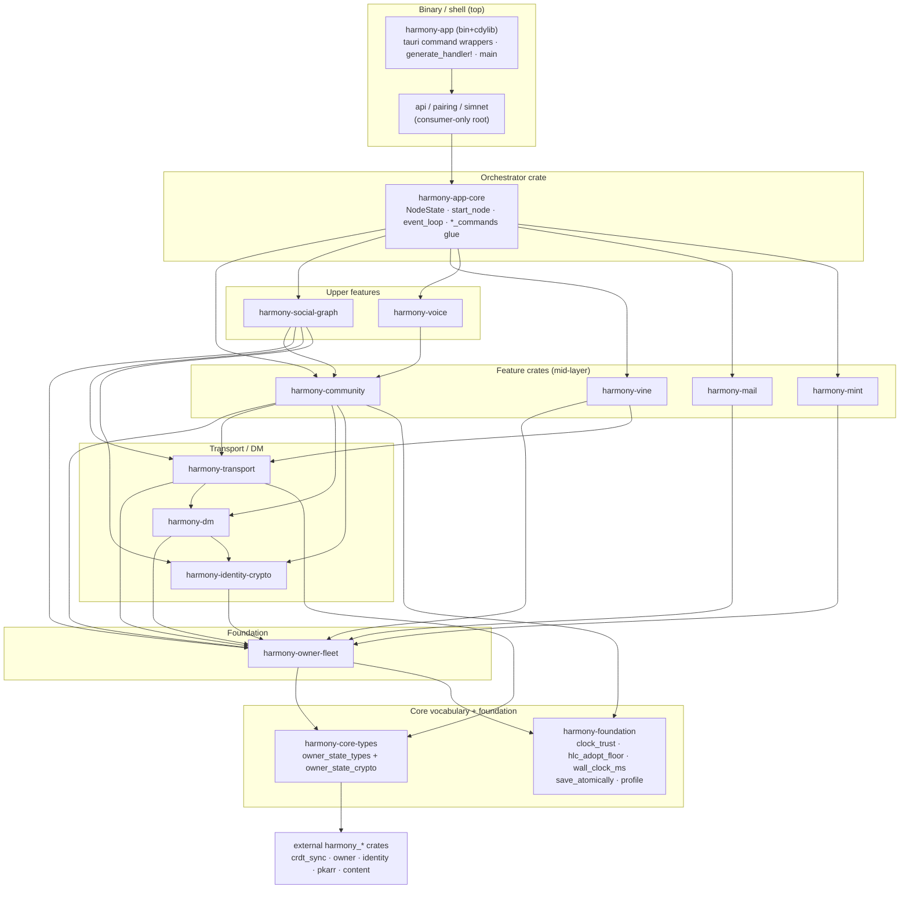

# ZEB-548 — Modularize the client: workspace crate split (Phase 1) + runtime-decomposition target (Phase 2)

**Status:** Design — awaiting review
**Date:** 2026-08-24
**Ticket:** [ZEB-548](https://linear.app/zeblith/issue/ZEB-548) (Explore: modularize the client)
**Related:** ZEB-987 (local build-speed levers — named this split as the real cold-tree fix), ZEB-765 (target disk), ZEB-451 (headless control surface — proves out-of-process driving), ZEB-164 (test-gate discipline)
**Decision (with Jake, 2026-08-24):** Pursue **both, phased** — do the build-graph crate split now (Phase 1, staged incremental), and document the runtime process/Zenoh decomposition as Phase 2 whose process boundaries the Phase-1 crate boundaries are chosen to enable. The two-month-old "do not start before v1" note is retained for Phase 2 but **retired for Phase 1**, which is runtime-neutral and therefore cannot destabilize v1.

---

## 1. The core reframe: ZEB-548 is two different projects

The ticket text describes **runtime decomposition** — separate modules coordinating over IPC-over-Zenoh, with independent processes and independent updates. But ZEB-987 pointed at ZEB-548 as the **build-graph crate split** — the 88k-line single crate recompiles wholesale on any edit. These are orthogonal:

| | ① Crate split (Phase 1) | ② Process split (Phase 2) | ③ IPC-over-Zenoh (Phase 2) |
|---|---|---|---|
| **What** | `harmony-app` → workspace of crates, **still one binary** | separate OS processes, independent lifecycles | Zenoh as the local coordination bus |
| **Runtime effect** | **none** | large | large |
| **Value** | measured (ZEB-987): kills wholesale recompile | speculative for v1 (update Files without restarting Communities; crash isolation) | only matters if ② |
| **Cost/risk** | bounded, staged | high (cut shared-Arc state into serialized IPC; per-module updater) | novel (proven substrate today is HTTP/WS, not Zenoh) + zenoh's own constraints |
| **v1 safety** | cannot destabilize v1 | must not land before v1 | must not land before v1 |

**A crate split changes nothing at runtime — it only changes what the compiler recompiles.** That is why Phase 1 is safe to do now and Phase 2 is not.

---

## 2. Current state (verified 2026-08-24)

- `harmony-app` is **one Rust package** — no `[workspace]` anywhere. `src-tauri/Cargo.toml` is a single package with `[patch.crates-io]` (vendored `netdev` + `zenoh-link` forks) at `:295` and `[profile.dev]` at `:286`.
- `src/lib.rs` is **87,879 lines**. Its composition:
  - **`NodeState`** (the composition root) at `lib.rs:820–1819`, ~150 fields.
  - **`start_node_inner`** at `lib.rs:4210–~16315` — **~12,100 lines in a single function** (boot + event-loop wiring). The hardest, most-tangled span.
  - **254 `#[tauri::command]` handlers** + their `_impl` bodies + helpers (~45k lines, ~51%).
  - **~26k lines (~30%) of inline `#[cfg(test)]` tests.**
  - `tauri::generate_handler!` registration at `lib.rs:76132` (~426 lines; stays in the binary).
- **But lib.rs is only ~20% of the crate.** The backend is already **234 `.rs` files / ~428k LOC**, largely modular by file. It is the **crate granularity** that is monolithic, not the file layout.
- **A de facto layering discipline already holds:** of 53 files that mention `NodeState`, only ~15 use it in an actual signature — all glue / `*_commands.rs` files. Every engine module (`*_sync`, `*_crdt`, `*_engine`) references `NodeState` **only in doc comments, never in code**. That discipline *is* the crate seam, and it is already the model used by the external `harmony_*` crates (`harmony_crdt_sync`, `harmony_owner`, `harmony_identity`, `harmony_pkarr`, `harmony_content`) that `NodeState` merely instantiates.
- The out-of-process control surface (`serve` + HTTP/WS API + `api` CLI, ZEB-445/447) already exists and is proven — components *can* already be driven across a process boundary today (relevant to Phase 2).

### Cluster inventory (the extraction units)

| Cluster | Files | LOC | Notes |
|---|---|---|---|
| community | 55 | 121.6k | biggest; `community_membership.rs` alone 20.2k |
| app_infra | 30 | 126.7k | `lib.rs` 87.9k + `event_loop.rs` 14.8k + recovery/storage/profile/notes glue |
| transport | 46 | 52.5k | `iroh_*`, `zenoh_iroh_*`, `network_health`, `tunnel_*`, relay/reconnect |
| owner_fleet | 22 | 43.4k | `owner_*`, `fleet_*`, `address_book_sync`, defines `owner_state_types` |
| dm | 14 | 25.0k | `dm_*`, `pending_dm_invites`, `reply_spill` |
| api/pairing/simnet | 27 | 13.6k | consumer-only root; nothing depends back on it |
| vine | 9 | 12.4k | `vine_*`, `pkarr_vines*` |
| identity_crypto | 7 | 10.6k | `identity`, `content_store`, `avatar_blob_store` (+`file_sharing`, misclassified) |
| mail_mint | 6 | 9.4k | `mail*`, `mint*` |
| social_graph | 11 | 7.7k | `friend_*`, `contacts_*`, `follows` |
| voice | 6 | 4.7k | `voice*` |

> **Inventory caveat (2026-08-25):** this table groups by filename prefix, which mis-bucketed a **foundation tier** into `app_infra` — `device_dataset_file` (ZEB-982), `clock_trust` (ZEB-831), `hlc_adopt_floor` (ZEB-790), and the `wall_clock_ms` source are near-leaf primitives depended on across every cluster, not app-infra glue. They belong at L0 (see the §3 DAG and the §6 Stage-1 correction). Treat cluster membership below as topical, not as crate boundaries — the per-file production-dependency scan is the authority.

---

## 3. Phase 1 target architecture: the crate DAG

`NodeState` is the **composition root and belongs at the top** — not in a `-core` crate. Feature crates must never depend on a crate that contains `NodeState` (that is the trap). The real `-core` is the pure-data vocabulary `owner_state_types` + `owner_state_crypto` (dependency-free except `harmony_crdt_sync` + `serde`), which every cluster already imports.

Notes on the DAG:
- Arrows are "depends on." The layering (L0 bottom → L4 top) is the topological order; the migration extracts bottom-up. The diagram is the **target after the §4 surgeries** — see the caveat below.
- **`harmony-foundation`** (added 2026-08-25 per the §6 Stage-1 correction; **broadened in PR #2** to also home `save_atomically` + `profile`) is a leaf with no `harmony-*` deps (`chrono`/`tracing`/`tempfile`; not even `core-types`) — and, like `core-types`, is depended on broadly across the mid-layer (`clock_trust`/`hlc_adopt_floor` have ~24/~23 dependents each; `save_atomically` has 11 callers spanning owner-fleet, community, identity-crypto, and app). Only representative edges are drawn to avoid clutter.
- `harmony-app-core` (L3) is where `NodeState`, `start_node_inner`, `event_loop.rs`, and the `*_commands.rs` glue live. The thin `#[tauri::command]` wrappers + `generate_handler!` stay in the **binary** crate `harmony-app` (L4) because they need the live `tauri::Wry` runtime; their `_impl` bodies migrate down into the feature crates.
- **`social_graph` and `voice` end up *above* `community`** (both depend on it one-way) once their shared primitives are promoted out: cycle E's `KeyedSlidingWindow` and cycle G's AEAD helpers move to shared modules, and cycle F's friend-acceptor logic relocates into `social_graph`.
- **Caveat — the mid-layer edges are the design target, not a guarantee.** The exact residual direction of a few edges (and two file relocations: `file_sharing` → dm in Stage 2, `iroh_friend_acceptor` → social_graph in Stage 3) is finalized as each surgery lands; the layering above is the intended acyclic result.

---

## 4. The 9 verified cycles and their surgeries

A naive `use crate::X` grep over-counts, because ~30–65% of several files is trailing `#[cfg(test)]`. Two apparent cycles (`owner_fleet ↔ dm`, `dm ↔ transport`) are **test-only** and are not real blockers — they need only a `[dev-dependencies]` edge, not graph surgery. The nine **production** cycles and their fixes:

| # | Cycle | Root cause (file:line) | Surgery |
|---|---|---|---|
| A | community ↔ owner_fleet | `owner_loaded.rs:20-22`, `address_book_sync.rs:11-17` import community/dm types | **Relocate `owner_loaded.rs` + `address_book_sync.rs` out of owner_fleet** into the orchestrator (`harmony-app-core`) — they are glue that bundles owner+community+dm handles, not owner-state core |
| B | community ↔ dm | `dm_outbox.rs:761` field of trait `community_relay.rs:586`; `community_state_sync.rs:7884` uses `dm_outbox::lookup_pubkey_for_device` | **Move `CommunityRelayDepositClient` trait to a shared relay-protocol module** (or transport); its method already takes `ButlerDepositRequest`. Move `lookup_pubkey_for_device` to a shared identity-resolver seam |
| C | community ↔ transport | `admission_oracle.rs:21` (transport) uses `community_topology`; `community_gateway_dial_driver.rs:27,30` + `community_presence.rs:18` (community) use `network_health`/`reconnect_supervisor` | **Move the `community_neighbors` topology helper to a shared location** so transport no longer depends on community; the surviving edge is community→transport (keeps the DAG acyclic) |
| D | owner_fleet ↔ vine | `fleet_net.rs:474` `build_vine_relay_set` uses `pkarr_vines`; `pkarr_vines.rs:23` uses `owner_state_types` | **Move `build_vine_relay_set` into `vine`** (owner_fleet hands raw device data, vine computes the set) |
| E | community ↔ social_graph | `open_join_admit.rs:32` uses `friend_intro::KeyedSlidingWindow`; `friend_token/friend_intro` use `community_invite/membership` | **Extract `KeyedSlidingWindow` (rate-limiter) into a shared handshake-primitives module** |
| F | social_graph ↔ transport | `friend_intro.rs:14` (social) uses `iroh_friend_acceptor`; `iroh_friend_acceptor.rs` (transport) uses `friend_*` | **Relocate the friend-specific acceptor logic (`iroh_friend_acceptor`) into `social_graph`**, leaving transport to expose generic iroh-accept primitives; social→transport becomes one-way |
| G | community ↔ voice | `community_presence.rs:19` (community) uses `voice_crypto` AEAD; `voice*` use `community_*` | **Promote the shared AEAD-seal helpers (`encrypt/decrypt_voice_packet`) to a shared crypto module**, cutting the community→voice edge; `voice` then depends on `community` one-way |
| H | community ↔ app_infra | `community_channel_log_engine.rs:2200` returns `event_loop::RbsrStep` | **Extract `RbsrStep` into a shared types module** so the engine does not depend on the orchestrator for a return type |
| I | dm ↔ identity_crypto | `file_sharing.rs:18` uses `dm_signing`; `dm_outbox.rs:24` uses `content_store` | **Move `file_sharing.rs` into the `dm` cluster** (it is DM-attachments, not an identity primitive) |

Nine distinct surgeries, one per cycle — each small and mechanical, landed as its own commit:
- **A** — relocate `owner_loaded.rs` + `address_book_sync.rs` into the orchestrator
- **B** — `CommunityRelayDepositClient` trait + `lookup_pubkey_for_device` → shared seam
- **C** — `community_neighbors` topology helper → shared
- **D** — `build_vine_relay_set` → vine
- **E** — `KeyedSlidingWindow` rate-limiter → shared handshake-primitives
- **F** — relocate `iroh_friend_acceptor` → social_graph
- **G** — voice AEAD-seal helpers → shared crypto
- **H** — `RbsrStep` → shared types module
- **I** — relocate `file_sharing.rs` → dm

---

## 5. NodeState handling

`NodeState` stays as the composition root in `harmony-app-core`. It is **not** an irreducible compile-cycle hub — engine modules already never call back into it in code. The extraction pattern already exists in the tree: `owner_loaded.rs`'s `OwnerLoadedHandles` atomically pulls the owner/community/dm handles out of `NodeState` for callers (its own doc note: "the ~144 existing ad-hoc sites are NOT mass-migrated here"). We replicate that narrow-handle pattern rather than threading `&Mutex<NodeState>` into feature crates.

Three fields need care (none is a compile cycle):

1. **`voting_log_engines` / `dfrost_log_registry`** (`lib.rs:1287,1155`) are generic over `tauri::Wry`, which would drag `tauri` into headless feature crates. **Fix:** make them non-generic like `ChannelLogRegistry` already is (`community_channel_log_engine.rs:2557`), moving Tauri emission to a callback/trait object — the precedent is `BeaconRequester` (`community_voting_log_engine.rs:129`), an `Arc<dyn Fn…>` injected explicitly so the engine holds no `Arc<Mutex<NodeState>>`. Do this **before or during** the community extraction.
2. **`hlc_tracker`** (`lib.rs:997`) is one `Arc` serving three roles across ~338 sites (owner-state replay, DM-mint monotonicity, channel-log). Type-clean (external `ReplayTracker`), but its *usage* cuts across owner-state/dm/channel-log crates. **Fix:** its access lives in `harmony-app-core`; feature crates receive narrower per-subsystem handles rather than the shared `Arc`. See `[[reference_client_hlc_tracker_three_roles]]`.
3. **`crdt_state` / `sync_engine` / `community_registry` triad** (`lib.rs:933,946,993`) has load-bearing **shutdown-ordering** coupling (`stop_inner` must tear these down before the event-loop thread joins). Type-safe to split; the orchestrator retains knowledge of their teardown contracts.

The managed-state seam is already abstracted: `NodeStateAccess` (`api/mod.rs:30`) with `impl for Mutex<NodeState>` (headless owned-Arc) vs `GuiStateAccess` (`api/gui_host.rs:65`, Tauri managed-state borrow). This trait already isolates the GUI/headless divergence and moves with `harmony-app-core`.

---

## 6. The staged sequence (Phase 1)

Each stage is an independently shippable, green-CI PR. Value is front-loaded; the hardest surgery (`start_node_inner` / `event_loop`) is last and can be re-evaluated on ROI.

### Stage 0 — Workspace scaffolding + `harmony-core-types`
- Convert `src-tauri/Cargo.toml` into the **workspace root** (a package can also be the workspace root). `[patch.crates-io]` and `[profile.*]` stay there (Cargo honors them only at root). New crates go under `src-tauri/crates/harmony-*`. Add `e2e-harness` as a member or leave it excluded.
- Extract `harmony-core-types` = `owner_state_types` + `owner_state_crypto`. Every other module keeps compiling by depending on it.
- **Build effect:** small directly, but unblocks everything. **Risk:** low.
- **Deliverable:** workspace builds; `harmony-app` depends on `harmony-core-types`; CI green.

> **Sequencing rule:** a cluster can be extracted into a crate only once *everything it depends on* is already a crate (otherwise it would depend on monolith code — a cycle with the binary). So extraction runs **bottom-up** in the DAG, and each cycle's surgery must land **before** the crate on the depending side is extracted.

### Stage 1 — Foundation + true leaves

> **Ground-truth correction (2026-08-25, ZEB-989).** A per-file production-dependency
> scan of `main` (test regions stripped) falsified this stage's original premise
> that surgeries A+D alone make `owner-fleet` a clean `core-types`-only leaf. Two
> facts drove a re-scope (decided with Jake — *foundation-first*):
>
> 1. **There is an unlisted foundation tier.** The §2 inventory grouped clusters
>    by filename prefix and swept `device_dataset_file` (ZEB-982 at-rest sealing),
>    `clock_trust` (ZEB-831), `hlc_adopt_floor` (ZEB-790), and the `wall_clock_ms`
>    source into "app_infra". These are near-leaves yet universally depended-on
>    (`device_dataset_file` alone: owner-fleet 54, mint 11, mail 8).
> 2. **owner-fleet is not a clean leaf after A+D.** Surgery A is confirmed (it
>    erases ~13 `community_*`/`voice_*`/`event_loop` edges — `address_book_sync`
>    is the most cross-coupled file in the cluster), but the core state/fleet files
>    still carry unlisted production couplings: `network_health` (17, transport),
>    `friend_graph` (8, *inside* the owner-state CRDT), `content_store` (7),
>    `dm_signing` (7), `butler_deposit` (6), `reachability_record` (8), `identity`
>    (18), plus command-glue back-edges (`owner_quorum_commands` 9, `owner_commands`
>    3) and an undocumented `owner_state ↔ identity` cycle. The "true leaves"
>    (mail/mint/idc) likewise couple to orchestrator bits (`node_event_sink`,
>    `event_loop`, `recoverable_load`), so they are not cleanly extractable right
>    after owner-fleet either.
>
> **Revised Stage-1 sequence:**
> - **PR #1 — `harmony-foundation`** ✅ *shipped (#735)* = `clock_trust` +
>   `hlc_adopt_floor` + `wall_clock_ms`. Pure leaves (deps: `chrono` + `tracing`;
>   not even core-types). Zero surgery — git mv + re-export from `lib.rs`, exactly
>   the Stage-0 pattern. Two cross-invariant test pins moved into
>   `community_membership` (compile-visible `const` asserts) since the leaf crate
>   cannot see the community cluster.
> - **PR #2 — broaden `harmony-foundation`** *(re-scoped 2026-08-25 after the
>   identity-crypto ground-truth scan below; decided with Jake)*. The
>   identity-crypto tier's only two real external couplings turned out to be
>   **universal primitives the §2 inventory mis-assigned to it**, so they move
>   *down* into `harmony-foundation` rather than into the tier:
>   - `owner_state_persist::save_atomically` — a generic atomic-write helper with
>     **11 callers** spanning owner-fleet (`fleet_key_epoch`, `fleet_dataset_file`,
>     `fleet_peer_seed_persist`), community (`community_channel_log`),
>     identity-crypto (`device_dataset_file`, `avatar_blob_store`), and app
>     (`friend_nicknames`, `emoji_names`, `backup_state`). Homing it in
>     identity-crypto would **invert the layering** (owner-fleet/community depending
>     *up* into identity-crypto for a filesystem write); foundation is the only
>     home below all of them. Return type narrows `PersistError → io::Result` (its
>     sole failure mode is I/O; `PersistError: From<io::Error>` keeps every `?` site
>     source-compatible), so foundation gains one durable-write primitive but no
>     owner-state coupling. Re-exported from `owner_state_persist`, so the
>     `crate::owner_state_persist::save_atomically` call path is unchanged. This
>     reverses PR #1's "no-I/O" framing — foundation is now "core primitives",
>     time/causality *and* durable write.
>   - `profile` (ZEB-446, active-profile selection) — a pure leaf (0 `crate::`
>     deps) that `identity` calls; moved to foundation with `crate::profile::*`
>     preserved by re-export. Two of its inline tests exercised harmony-app path
>     helpers (`app_data_dir_in` / `resolve_app_data_dir_from`) and relocated to
>     harmony-app's `mod tests`.
> - **PR #3 — `harmony-identity-crypto`+sealing** = `identity` + `device_dataset_file`
>   + `content_store` + `avatar_blob_store`. Now a genuine `core-types`+`foundation`
>   leaf: keeping `device_dataset_file` *with* `identity` makes its
>   `identity::read_seed_from_disk` call intra-crate, and PR #2 already put
>   `save_atomically`/`profile` beneath it. (`fetch_avatar` / `fleet_dataset_file`
>   references in this tier are doc-comment intra-links, not code deps.)
> - **PR #4+ — `harmony-owner-fleet`** (re-planned from the corrected coupling map:
>   surgery A + cutting the network/social/dm couplings above) and the remaining
>   leaves (`mail`, `mint`) once their orchestrator couplings are resolved.
>
> The bottom-up strategy and the §7 mechanics are unchanged; only the cluster
> assignments and the intra-stage PR sequence are corrected.

*(Original plan, retained for context — superseded by the correction above.)*
- Surgeries **A** (relocate `owner_loaded`/`address_book_sync`) and **D** (`build_vine_relay_set` → vine) first — both are prerequisites that make `owner-fleet` depend only on `core-types`.
- Extract `harmony-owner-fleet`, then the true leaves that depend only on owner-fleet/core: `harmony-mail`, `harmony-mint`, `harmony-identity-crypto` (minus `file_sharing.rs`). (Note: `voice` is **not** a leaf — it depends on `community`, so it lands in Stage 3.)
- Move each cluster's inline tests **with** the cluster (tests only reduce build time once they leave the `harmony-app` crate).
- **Build effect:** edits within mail/mint/identity now recompile only those crates. **Risk:** low.

### Stage 2 — Transport/DM spine + vine
- Surgeries **I** (`file_sharing` → dm), **B** (`CommunityRelayDepositClient` + `lookup_pubkey` seam), **C** (`community_neighbors` → shared) — each removes a cross-edge before the crate on the depending side is extracted.
- Extract `harmony-dm` (after idc), `harmony-transport` (after dm), `harmony-vine` (after transport).
- **Build effect:** the transport/dm spine (transport 52k, dm 25k) recompiles independently. **Risk:** medium — trait extractions are mechanical but wide; land each surgery as its own commit, `cargo build --lib` + `scripts/test-select` between.

### Stage 3 — Community, its dependents, and orchestrator thinning
- Surgeries **E** (`KeyedSlidingWindow` → shared), **F** (`iroh_friend_acceptor` → social_graph), **G** (voice AEAD → shared crypto), **H** (`RbsrStep` → shared types). Normalize the `tauri::Wry` generics (§5.1) here, before community extraction.
- Extract `harmony-community` (121k — the single biggest win), then the crates that sit **above** it: `harmony-social-graph` and `harmony-voice`.
- Move the 254 command `_impl` bodies into their feature crates, leaving thin `#[tauri::command]` wrappers in the binary. Extract `harmony-app-core` (NodeState + `start_node_inner` + `event_loop` + glue), leaving `harmony-app` as the thin bin/cdylib shell + `generate_handler!` + `api`/`pairing`/`simnet`.
- **Build effect:** maximal — community work and command-body edits recompile only their crate. **Risk:** high (`start_node_inner`, event-loop wiring, hlc_tracker plumbing, shutdown ordering). **This stage is the natural stop/re-evaluate gate** — if Stages 0–2 already captured the day-to-day inner-loop win, Stage 3 can be deferred without loss.

### Honest build-time expectation
A crate extraction speeds up only edits **inside** that crate (plus relink). Leaves give quick modest wins; the biggest payoff is community (Stage 3), which is also where the most active dev *and* the most cycles are — value and difficulty are correlated. There is no free lunch from moving code between files within one crate; the win comes strictly from new crate boundaries. `--lib` (ZEB-987) remains the inner-loop gate discipline throughout; `--all-targets` remains the pre-PR gate (ZEB-164).

---

## 7. Workspace mechanics (gotchas)

- **`[patch.crates-io]` and `[profile.*]` are workspace-root-only.** Keeping `src-tauri/Cargo.toml` as the root avoids moving them; the vendored `vendor/netdev` + `vendor/zenoh-link` paths stay valid.
- **Tauri expects the app crate at `src-tauri`.** `harmony-app` remains the bin/cdylib there; `tauri.conf.json` is unchanged. New library crates live under `src-tauri/crates/`.
- **`e2e-harness`** currently spawns the built binary via `HARMONY_APP_BIN` (not a path lib-dep), so it can stay excluded — the simplest choice, and it keeps the src-tauri-rooted workspace clean (e2e-harness is a repo-root sibling, awkward to add as a member of a root at `src-tauri/`). If we later want it in the workspace, the alternative is to root the workspace at the repo top (`/Cargo.toml`), which then requires relocating `[patch.crates-io]` + `[profile.*]` there (vendor paths become `src-tauri/vendor/*`). Recommend the src-tauri root + excluded e2e-harness for Stage 0.
- **CI/local commands already pass `--workspace`** (see CLAUDE.md quick reference), so new members are picked up with **zero command changes** — the single-package manifest is already an implicit one-member workspace.
- **sccache** stays active; more, smaller crates improve cache-hit granularity.
- **`target/` disk** (ZEB-765): a workspace shares one `target/`; net disk is roughly neutral, but incremental artifacts become per-crate. `scripts/build-gc` unchanged.
- **CI**: the 3 nextest shards + fmt/clippy/MSRV run over the whole workspace unchanged (`--workspace`); no path-filtering today, so no CI-config change is required, though per-crate test selection becomes possible later.

---

## 8. Phase 2 (parked): runtime process/Zenoh decomposition

Documented now so Phase 1 boundaries are drawn to enable it; **not** to be built before v1.

- **Process boundaries = the Phase-1 crate boundaries.** The clusters that make natural separate processes: transport, community, dm, vine, mail, mint, voice. Each already has a clean crate seam after Phase 1.
- **Substrate:** the ticket aspires to IPC-over-Zenoh, but the **proven** out-of-process substrate today is the HTTP/WS `serve` API (ZEB-445/447). Recommend HTTP/WS (or a local domain-socket variant of it) as the pragmatic Phase-2 substrate; treat Zenoh-for-local-IPC as a separate spike, given zenoh's constraints (`[[reference_zenoh_no_custom_transport]]`, reply-drain backpressure, linkstate edge-bound flood).
- **The hard barrier:** shared in-process state. `NodeState` and especially `hlc_tracker` (one Arc, 3 roles) would have to be cut into serialized IPC with an owner-of-record per datum. This is the bulk of Phase 2's cost and why it is deferred.
- **Forcing-function criteria to revisit Phase 2** (from the ticket): a concrete need to update/restart one module without the others; crash-isolation value for a specific subsystem; or an agent/testing ergonomic that a process boundary serves better than the existing headless API. Absent one of these, the monolith-binary (post-crate-split) is the right shape for v1 and likely beyond.

---

## 9. Risks & mitigations

| Risk | Mitigation |
|---|---|
| `start_node_inner` (12k-line fn) resists extraction | Deferred to Stage 3; extract incrementally behind the existing owned/borrowed NodeState seams; it can stay in `harmony-app-core` without blocking earlier stages |
| `event_loop.rs` type leaks (`RbsrStep`) | Surgery H extracts leaked types to a shared module first |
| `hlc_tracker` plumbing churn (~338 sites) | Access stays in `harmony-app-core`; narrow handles threaded down; `DeviceHlcStore`-style adapter avoids retyping call sites (`[[reference_client_hlc_tracker_three_roles]]`) |
| Shutdown-ordering regressions | Preserve `stop_inner` teardown order; the triad stays co-located in the orchestrator |
| `tauri::Wry` generics drag tauri into headless crates | Normalize to non-generic + callback trait (BeaconRequester precedent) before community extraction |
| Test drift during moves | Move tests with their cluster; `--all-targets` gate each PR; broken tests on main are ours (`[[feedback_test_drift_is_our_fault]]`) |

---

## 10. Decision & follow-up tickets

- **Do Phase 1, staged incremental.** Retire the "not before v1" note for Phase 1 (runtime-neutral). Keep it for Phase 2.
- **Proposed ticket structure:** ZEB-548 becomes the parent/epic; file one child per stage:
  - Stage 0 — workspace scaffolding + `harmony-core-types`
  - Stage 1 — surgeries A, D; foundation `harmony-owner-fleet` + leaf crates (mail, mint, identity-crypto)
  - Stage 2 — surgeries B, C, I; transport/DM spine (`harmony-dm`, `harmony-transport`, `harmony-vine`)
  - Stage 3 — surgeries E, F, G, H; `harmony-community` + dependents (social-graph, voice) + orchestrator thinning (gated on ROI re-eval)
  - A Phase-2 tracking child (parked) — runtime process/Zenoh decomposition + forcing-function criteria
- **Out of scope:** any runtime behavior change; frontend restructuring (the FE is already service-file-modular; only `App.svelte` at 5.5k lines is a monolith — a separate concern); the external `harmony_*` git-dep crates (already separate).

---

## 11. Non-goals

- Not decomposing `NodeState` into per-subsystem structs beyond what cycle-cutting requires (the `OwnerLoadedHandles` pattern is applied where it removes a `&Mutex<NodeState>` from a crate boundary, not as a global refactor).
- Not introducing a central typed FE↔BE invoke layer (natural companion, but separate work).
- Not changing the `--lib` / `--all-targets` gate discipline.
