# See Harmony in action

A guided tour of the Harmony client, from first launch to a living community.

Every screenshot below is the **real v0.2.10 release** running on macOS — no mockups.
A fresh identity ("Rosa") walks through onboarding, founds a neighborhood garden club,
and is joined by three real peers (Sam, Priya, and Tomás) over Harmony's actual P2P
stack. Everything you see — the joins, the messages, the presence dots — happened live
between four independent Harmony nodes.

---

## 1. First launch

The first thing Harmony tells you is the most important thing about it: **your identity
lives only on your device**. There's no account to create, no server holding your data,
and no password-reset email — because there's no company on the other end.

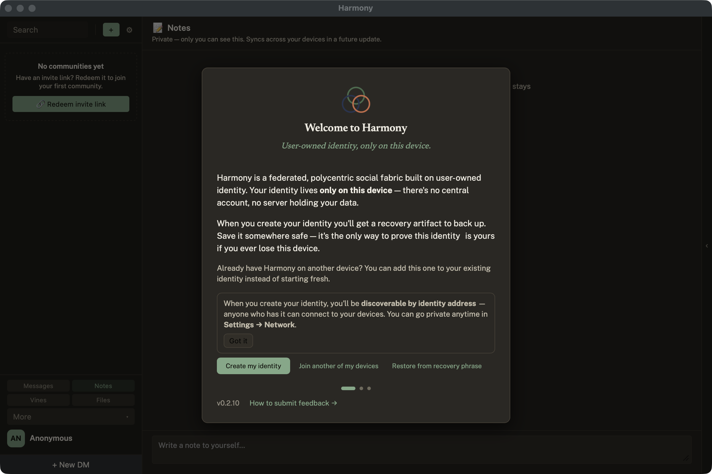

## 2. Back up your identity

Creating an identity mints a cryptographic key on your device. Harmony immediately asks
you to back it up — as an encrypted recovery file protected by a passphrase, or as a
24-word recovery phrase you write down.

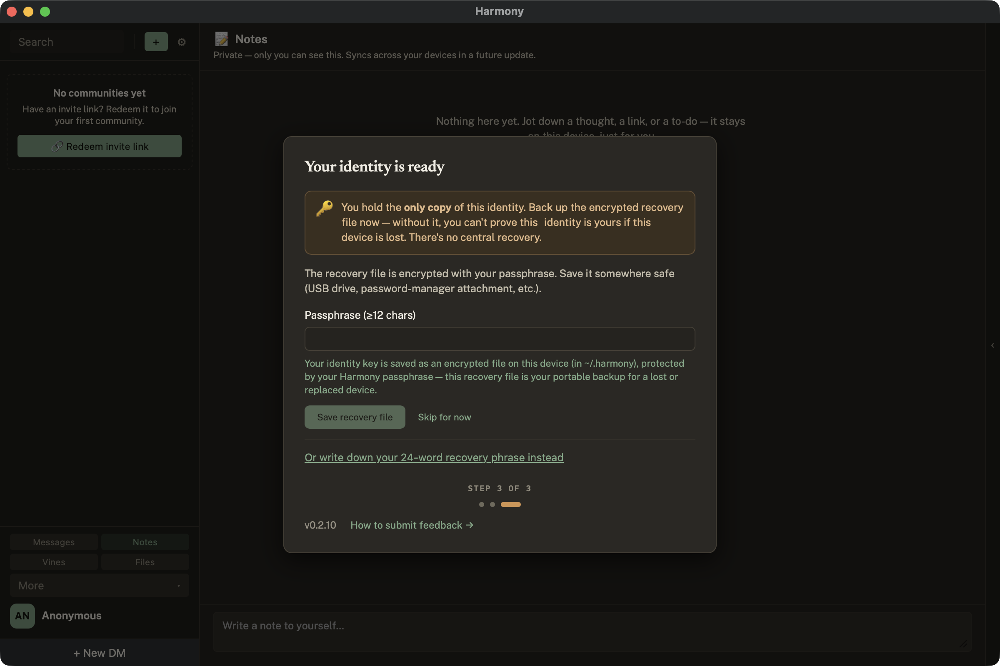

If you skip the backup, Harmony is honest about what that means. "Self-sovereign" cuts
both ways: nobody can take your identity from you, and nobody can restore it for you
either. (You can back up later — the app keeps a gentle reminder banner until you do.)

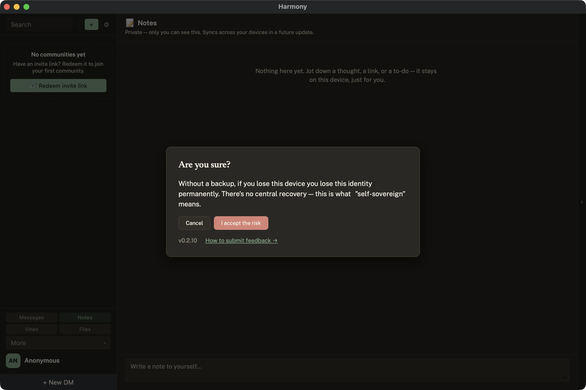

## 3. Pick your name

Your display name is how people see you on messages. It's not a unique handle and
doesn't need to be claimed or registered — your cryptographic identity is what actually
identifies you; the name is just a label you control, changeable anytime.

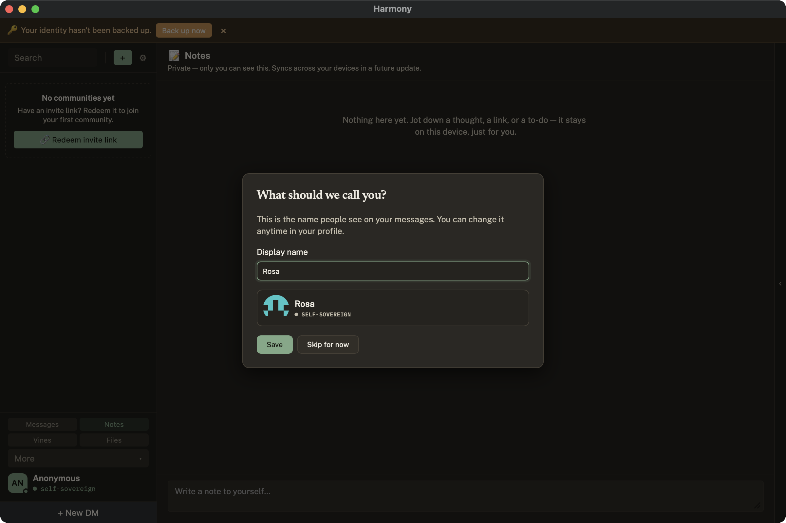

## 4. Home

The main window: communities and direct messages on the left, the active view in the
middle, and mode buttons (Messages, Notes, Vines, Files, and more) in the bottom-left.
The footer shows your identity and its self-sovereign status.

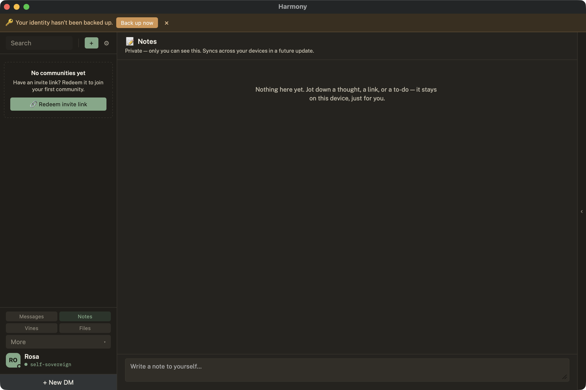

## 5. Found a community

The **+** button opens the create menu — new DMs, group DMs, communities, invite
redemption, and more.

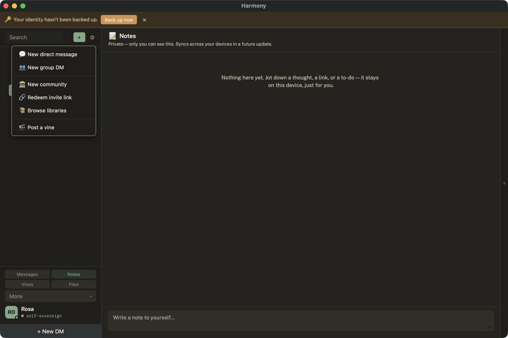

Communities come in two flavors: **Open** (anyone with the URL can join) and
**Invite-only** (each invite link works exactly once — more on that below).

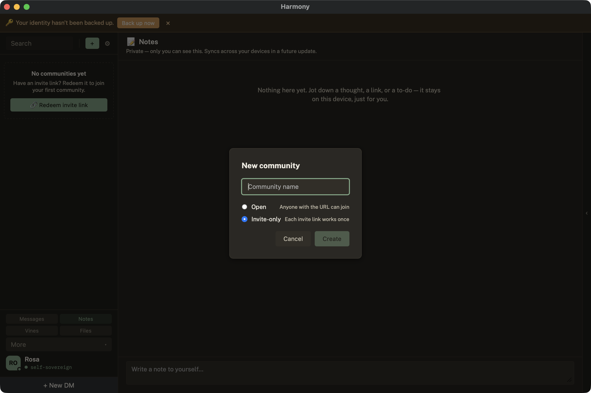

Every new community is born with governance built in. Note the **Proposals**,
**Constitutional**, and **Charter** tabs in the header, and the built-in `⚖ proposals`
channel next to `#general` — in Harmony, community self-governance is a first-class
feature, not an afterthought.

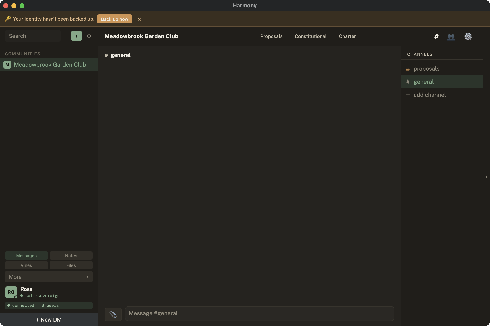

## 6. Channels

Channels come in three kinds: **Text**, **Voice**, and **Town Hall** — the latter being
a structured deliberation space for decisions that deserve more than a chat scroll.

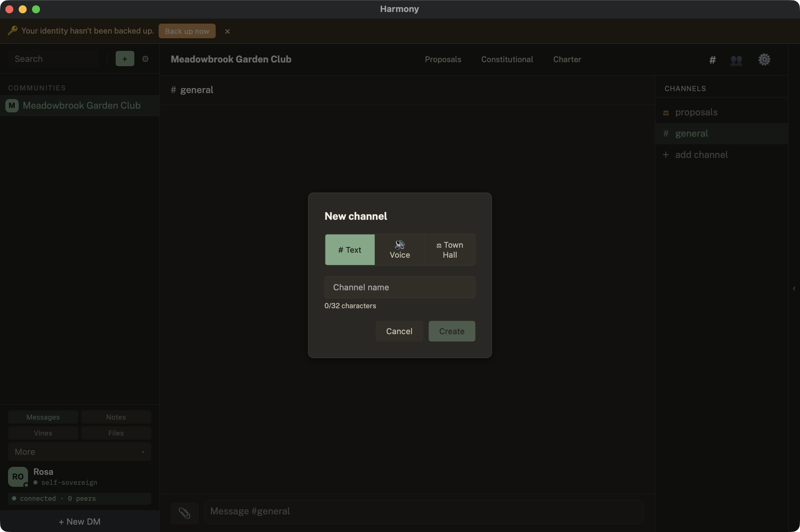

## 7. Invite people

Invite-only communities use **one-time invite links**: each link embeds the inviter's
cryptographic signature and can be redeemed exactly once. Generate one from community
settings, hand it to a friend over any channel you trust, and it's dead the moment they
use it.

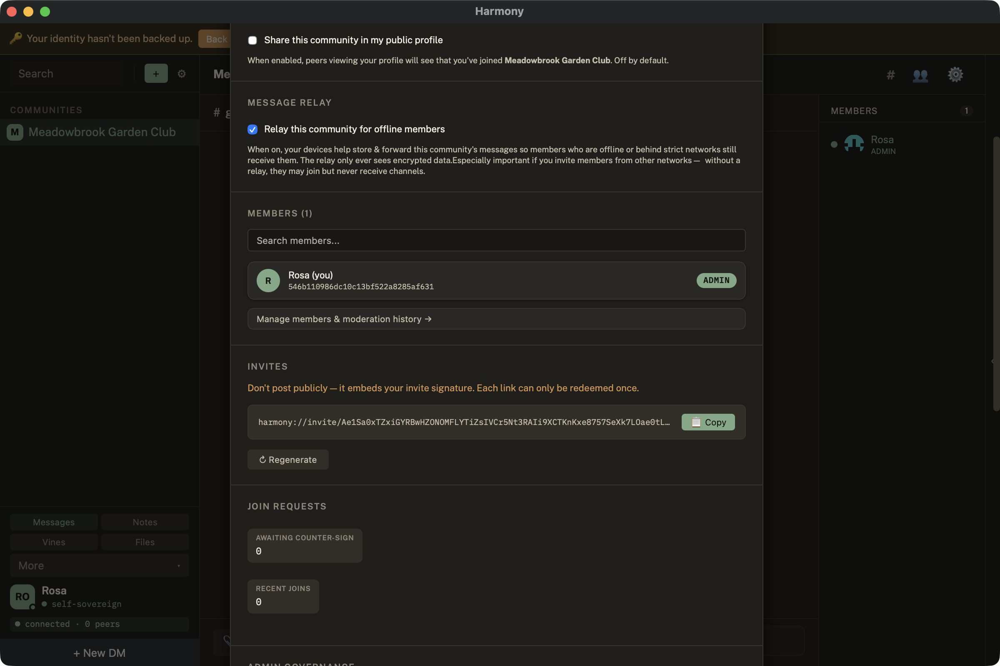

## 8. People arrive

As invites are redeemed, members appear with their names and roles. Admins get
moderation affordances — role assignment and removal — and the join-request panel
tracks the counter-signing that admits each new member.

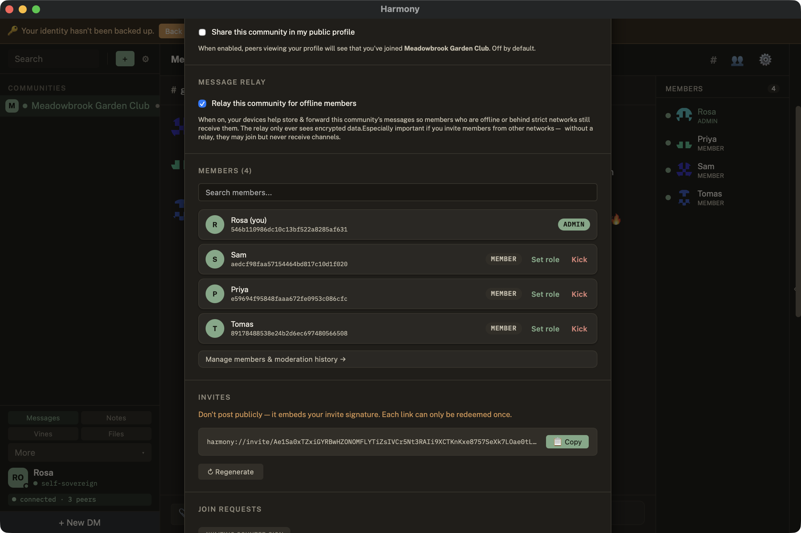

## 9. Talk

Messages flow peer-to-peer between members' devices — end-to-end, with no server in
the middle. Rich text, emoji, replies, reactions, mentions, and file attachments all
work the way you'd expect.

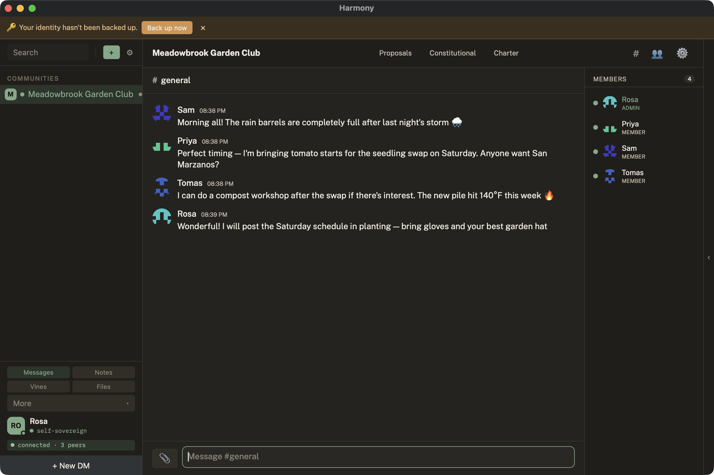

## 10. Presence that tells the truth

Every member row carries a presence dot fed by live peer-to-peer beacons. When a peer
stops responding — closed laptop, dead network, wandered off — their dot honestly
decays to a hollow "stale" state within about a minute, rather than lying green.

In this shot, Tomás's node has just gone offline: his dot has gone hollow while
Rosa, Priya, and Sam stay solid green. Compare with the previous screenshot, taken
while all four were live.

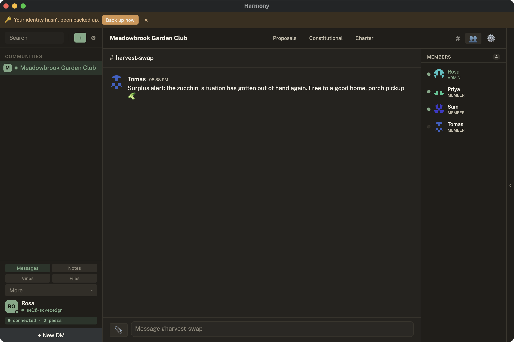

---

## Where to next?

- **Install Harmony**: [macOS](../install-macos.md) · [Windows](../install-windows.md) ·
  [Linux](../install-linux.md) · [headless](../headless-install.md)
- **Join the alpha**: grab an invite and see [docs/feedback.md](../feedback.md) for how
  to send feedback from inside the app.

## About these screenshots

These captures are reproducible. Each scene was staged on a single machine using
Harmony's profile isolation (`HARMONY_PROFILE`) to run one GUI instance plus three
headless `harmony-app serve` peers side-by-side with the maintainer's real identity
untouched, and driven end-to-end over the localhost control API (`HARMONY_API_PORT`) —
the same 119-command surface the app itself uses. The GUI was operated by synthetic
clicks/keys and captured with macOS `screencapture`; peer joins used real
`harmony://invite/...` redemption over the live transport stack. To refresh the set
after a UI change, replay the same flow on a fresh profile.
